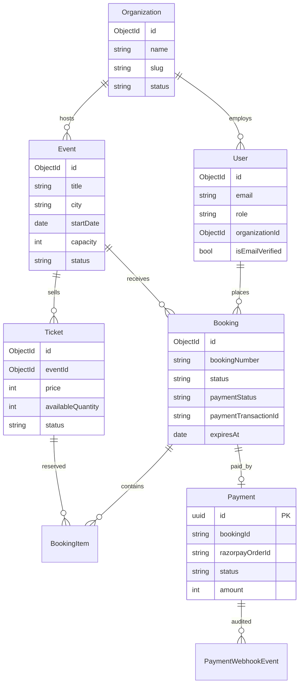

# Database schema

```mermaid
erDiagram
  Organization ||--o{ User : employs
  Organization ||--o{ Event : hosts
  Event ||--o{ Ticket : sells
  User ||--o{ Booking : places
  Event ||--o{ Booking : receives
  Booking ||--o{ BookingItem : contains
  Ticket ||--o{ BookingItem : reserved
  Booking ||--o| Payment : paid_by
  Payment ||--o{ PaymentWebhookEvent : audited

  Organization {
    ObjectId id
    string name
    string slug
    string status
  }
  User {
    ObjectId id
    string email
    string role
    ObjectId organizationId
    bool isEmailVerified
  }
  Event {
    ObjectId id
    string title
    string city
    date startDate
    int capacity
    string status
  }
  Ticket {
    ObjectId id
    ObjectId eventId
    int price
    int availableQuantity
    string status
  }
  Booking {
    ObjectId id
    string bookingNumber
    string status
    string paymentStatus
    string paymentTransactionId
    date expiresAt
  }
  Payment {
    uuid id PK
    string bookingId
    string razorpayOrderId
    string status
    int amount
  }
```

Mongo collections: User, RefreshToken, Otp, PasswordResetToken, Organization, Event, Ticket, Booking.

MySQL tables: payments, payment_webhook_events.
